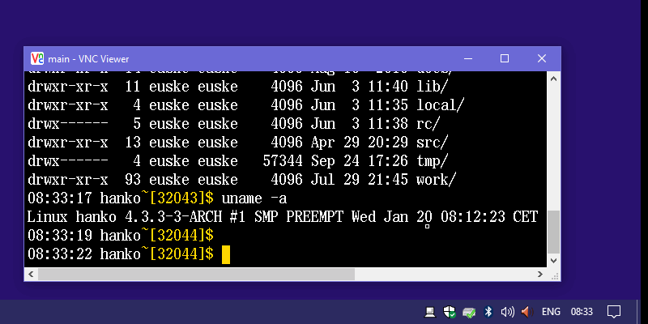

# PyRexecd

PyRexecd is a standalone SSH server for Windows.

## Features:

  * Standalone Win32 app (not a service) that resides in SysTray.
  * Supports a single user / pubkey auth only.
  * Notifies incoming connections via popup.
  * Sends/Receives the clipboard text via stdin/stdout.

## Prerequisites:

  * Python 3 (or 2) - http://www.python.org/
  * Paramiko - http://www.paramiko.org/
  * PyWin32 - http://sourceforge.net/projects/pywin32/
  * cx_Freeze (optional) - https://pypi.python.org/pypi/cx_Freeze

## How to Use:

  1. `> pip install pyrexecd`
  1. Run `PyRexec.pyw`.  
     It generates a new host key and opens a config directory
     (`AppData\Roaming\PyRexecd`).
  1. Put your public key into the config dir.  
    `> copy your\id_rsa.pub authorized_keys`
  1. Run `PyRexec.pyw` to start the server.
  1. Log into the machine via 2200/tcp. 
    `$ ssh -p 2200 windows`

## Command Line Syntax:

    > pyrexecd.exe [-d] [-l logfile] [-s sshdir] [-L addr] [-p port]
                   [-c cmdexe] [-u username] [-a authkeys] [-h homedir]
		   ssh_host_key ...

  * `-d` : Turns on Debug mode (verbose logging).
  * `-l logfile` : Log file path (default: `pyrexecd.log`).
  * `-s sshdir` : Config directory path. (default: `AppData\Roaming\PyRexecd`)
  * `-L a.b.c.d` : Specifies the listen address (default: `127.0.0.1`).
  * `-p port` : Specifies the listen port (default: `2200`).
  * `-c cmdexe` : cmd.exe path. (default: `cmd.exe`)
  * `-u username` : Username.
  * `-a authkeys` : authorized_keys path. (default: `authorized_keys`)
  * `-h homedir` : Home directory path. (default: `%UserProfile%`)

## Special commands:

  Certain SSH command is recognized as special commands:

  * `@clipget` : Receives the clipboard text from Windows. 
    `$ ssh windows @clipget > clipboard.txt`
  * `@clipset` : Sends the clipboard text to Windows. 
    `$ echo foo | ssh windows @clipset`
  * `@open`, `@edit`, and `@print` : Windows shell operation.
    The target pathname should be given from stdin. 
    `$ echo C:\User\euske\foo.txt | ssh windows @edit`

## How to Build .exe (requires cx_Freeze):

    > pip install cx_Freeze
    > python setup_exe.py build
